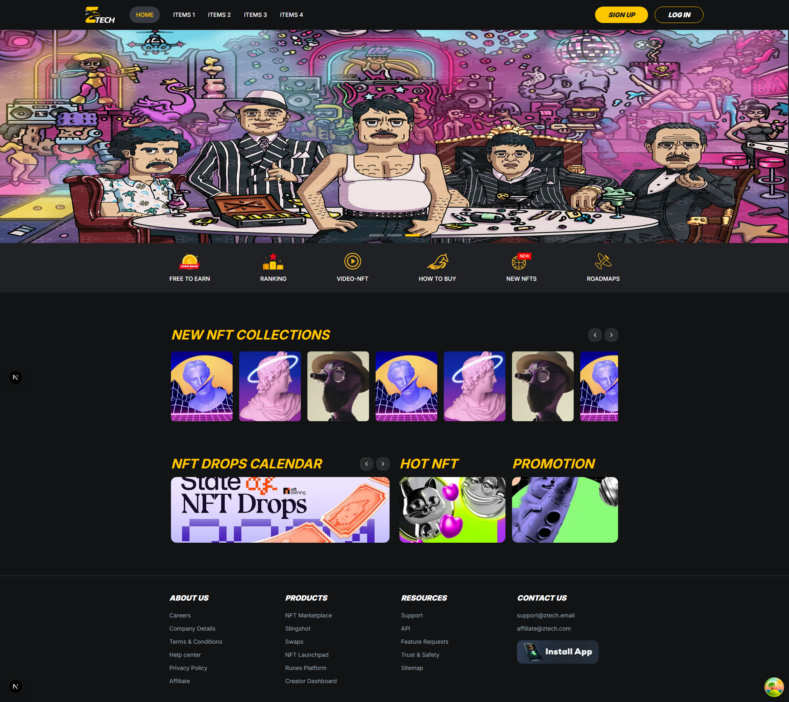

# 🚀 Nevel Test Project  

  

## 📌 Giới thiệu  
Dự án được xây dựng với **Next.js 15** và các công nghệ hiện đại, tập trung vào UI đẹp mắt và responsive.  

👉 [Xem thiết kế trên Figma](https://www.figma.com/design/hmpcx7ExksgznDanSeShZq/Bài-test?node-id=5-759)  

---

## 🛠️ Công nghệ sử dụng  

<p align="left">
  
</p>

- ⚡ **Next.js 15** – Framework React mạnh mẽ cho SSR & SSG.  
- 🔐 **TypeScript** – Tăng tính an toàn & dễ bảo trì code.  
- 🎨 **TailwindCSS** – Utility-first CSS framework.  
- 🧩 **shadcn/ui** – Bộ UI components hiện đại.  
- 🎥 **Framer Motion** – Animation mượt mà & đẹp mắt.  

---

## 🚀 Hướng dẫn chạy dự án  

```bash
# Clone repository
git clone https://github.com/sinhdevops/nevel-test

# Vào thư mục dự án
cd nevel-test 

# Cài đặt dependencies
pnpm install

# Chạy dev server
pnpm run dev
